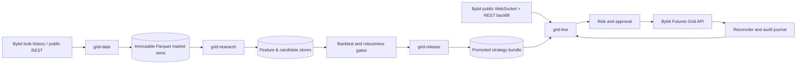

# brullik-bybit-grid-bot-research

Documentation-first architecture for a high-throughput Bybit Futures Grid Bot research-to-live platform.

> **Repository state:** architecture and governance baseline only. No trading code is included in this initial package.

[Русская версия](README.ru.md)

## Final goal

Build a production-grade, auditable, fail-closed system that can:

1. acquire, validate, and maintain a capacity envelope of **700 instruments × 10 years × 1-minute history**;
2. process roughly **3.68 billion trade-price 1m candles**—and about **7.36 billion candle rows** when a parallel 1m mark-price dataset is retained—without repeatedly rescanning the full corpus;
3. detect horizontal consolidation/range candidates, estimate suitable parameters for a **Bybit native Futures Grid Bot** in **Neutral + Geometric** mode, and validate them with walk-forward, out-of-sample, and out-of-symbol tests;
4. promote only immutable, fully validated strategy releases;
5. run the live subsystem independently, without starting or installing the history downloader or research/optimization stack;
6. validate, create, monitor, reconcile, and close grid bots through Bybit only after explicit safety gates are satisfied.

The 700 × 10-year statement is a **capacity and coverage objective**. Real data for a given instrument starts at its actual listing time and ends at delisting; missing pre-listing history must never be fabricated.

## Why the architecture is split

The project is designed as three independently startable applications plus a small promotion/control utility:

| Application | Purpose | Bybit trade credentials | Historical corpus required |
|---|---|---:|---:|
| `grid-data` | Bulk download, REST gap fill, normalization, quality audit, compaction | No | Writes it |
| `grid-research` | Features, candidates, outcomes, parameter search, backtests, robustness | No | Yes, read-only |
| `grid-live` | Current market data, signals, risk, approval, native grid execution, reconciliation | Yes | No |
| `grid-release` | Build, verify, promote, revoke immutable strategy bundles | No | Reads research outputs only |

The live application consumes one promoted **strategy release bundle** and a small rolling market-data window. It must not import research orchestration, scan the multi-billion-row historical lake, or modify research datasets.

## Architecture at a glance

## Performance strategy

The architecture prioritizes throughput and predictable resource use:

- bulk historical archives first; REST is used for recent data and deterministic gap repair;
- Parquet/ZSTD columnar storage, sorted by instrument and time;
- monthly time partitions plus a small stable symbol-hash bucket count instead of one tiny partition per symbol;
- DuckDB for set-oriented SQL and catalog/audit queries;
- Polars lazy scans, predicate/projection pushdown, multithreading, and streaming execution;
- reusable feature materialization so parameter searches do not recompute rolling indicators for every trial;
- event/candidate sparsification before expensive grid-path simulation;
- deterministic sharding with lookback halos and idempotent receipts;
- immutable dataset manifests and atomic commit markers;
- benchmark gates on reference hardware before any full 700 × 10-year build.

See [Performance and capacity](docs/06_PERFORMANCE_AND_CAPACITY.md) and [Data platform](docs/05_DATA_PLATFORM.md).

## Current product baseline

- Exchange: Bybit.
- Market: linear USDT perpetual contracts.
- Signal timeframe: 1 minute.
- Strategy baseline: horizontal range/consolidation detection.
- Native bot mode: Neutral + Geometric.
- Initial capital assumption: 500 USDT.
- Maximum intended loss per grid: 5 USDT.
- Trailing up/down: disabled in V1.
- One active grid per symbol.
- Initial real executions: manual approval.
- Emergency stop: mandatory; new entries stay blocked until explicit resume.

These are controlled assumptions, not promises of profitability. They can change only through the change-control process and a recorded architecture/product decision.

## Documentation map

| Document | Purpose |
|---|---|
| [Project charter](docs/00_PROJECT_CHARTER.md) | Authority, mission, constraints, operating model |
| [Final goal and success criteria](docs/01_FINAL_GOAL_AND_SUCCESS_CRITERIA.md) | End-state definition and measurable outcomes |
| [Scope and principles](docs/02_SCOPE_AND_PRINCIPLES.md) | In-scope, non-goals, non-negotiable rules |
| [System context](docs/03_SYSTEM_CONTEXT.md) | Actors, boundaries, external dependencies |
| [Target architecture](docs/04_TARGET_ARCHITECTURE.md) | Components, dependency graph, deployment units |
| [Data platform](docs/05_DATA_PLATFORM.md) | Ingestion, canonical store, partitioning, lineage |
| [Performance and capacity](docs/06_PERFORMANCE_AND_CAPACITY.md) | Scale model, benchmarks, hardware envelope |
| [Research architecture](docs/07_RESEARCH_AND_PARAMETER_SELECTION.md) | Candidate detection and efficient parameter search |
| [Backtest and validation](docs/08_BACKTEST_AND_VALIDATION.md) | Anti-lookahead, robustness, promotion gates |
| [Strategy release contract](docs/09_STRATEGY_RELEASE_CONTRACT.md) | Immutable interface between research and live |
| [Live architecture](docs/10_LIVE_ARCHITECTURE.md) | Market data, signal, risk, execution, reconciliation |
| [Run-mode isolation](docs/11_RUN_MODES_AND_ISOLATION.md) | How history, research, release, and live run separately |
| [Security, risk, safety](docs/12_SECURITY_RISK_AND_SAFETY.md) | Credentials, fail-closed behavior, emergency controls |
| [Observability and recovery](docs/13_OBSERVABILITY_AUDIT_AND_RECOVERY.md) | Logs, metrics, receipts, backup and restart |
| [Roadmap and gates](docs/14_ROADMAP_AND_GATES.md) | Delivery sequence through live readiness |
| [Repository layout](docs/15_REPOSITORY_LAYOUT.md) | Planned monorepo structure; no code yet |
| [Data contracts](docs/16_DATA_CONTRACTS.md) | Versioned datasets and runtime state schemas |
| [Decision register](docs/17_DECISION_REGISTER.md) | Accepted decisions and pending ADRs |
| [Open questions](docs/18_OPEN_QUESTIONS.md) | Items that require evidence before implementation |
| [Glossary](docs/19_GLOSSARY.md) | Project terminology |
| [References](docs/20_REFERENCES.md) | Authoritative external documentation |
| [GitHub repository settings](governance/GITHUB_REPOSITORY_SETTINGS.md) | Public repository configuration and protections |

## Delivery order

1. Documentation and architecture baseline.
2. Repository controls and PM-owned acceptance criteria.
3. Public data feasibility and benchmark spike.
4. Canonical historical market store.
5. Feature/candidate/outcome datasets.
6. Backtest and robustness framework.
7. Strategy release registry and promotion workflow.
8. Live shadow mode with no execution.
9. Manual mainnet execution with one active bot.
10. Controlled scale-up only after evidence-based approval.

The detailed sequence is in [planning/ROADMAP.md](planning/ROADMAP.md).

## Safety notice

This project is experimental trading infrastructure. It does not guarantee profit and must not enter autonomous live trading merely because a backtest is positive. Live execution remains blocked until all acceptance gates, reconciliation tests, credential controls, and emergency procedures are proven.
