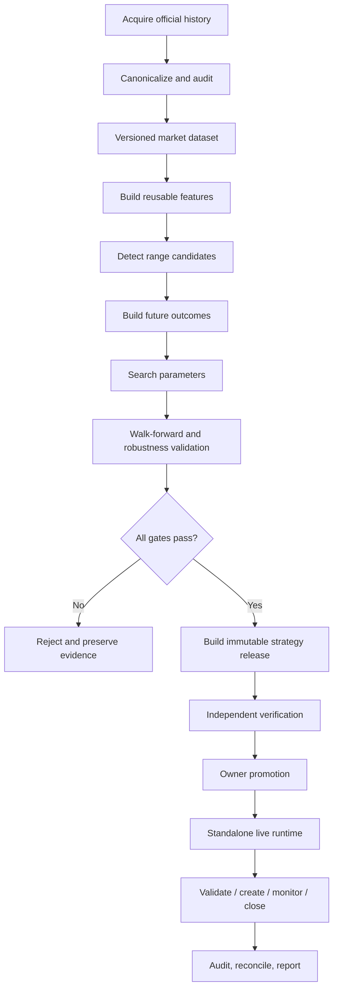

# Final Goal and Success Criteria

## Final goal statement

Create a production-ready, high-throughput, auditable platform that converts Bybit market history into independently verified grid-strategy releases and executes only promoted releases in a standalone live runtime.

The platform must be engineered for a capacity envelope of:

- **700 instruments**;
- **10 years** of horizon;
- **1-minute granularity**;
- approximately **3,681,644,400 trade-price candles** at full theoretical coverage;
- approximately **7,363,288,800 candle rows** if trade-price and mark-price 1m histories are stored in parallel.

These are capacity numbers. Actual instrument coverage follows listing, trading, suspension, and delisting intervals recorded by the universe registry.

## Required end-to-end flow

## Functional success criteria

### Data

- Universe registry contains stable instrument identities and dated metadata snapshots.
- Historical download supports bulk sources, paginated APIs, resume, throttling, retry, checksums, and deterministic gap repair.
- Canonical 1m OHLCV, mark-price, funding, and instrument metadata have versioned schemas.
- Every committed dataset version has a manifest, row counts, min/max timestamps, hashes, data-quality summary, and provenance.
- Duplicate/conflicting keys, orphan files, partial writes, stale build markers, and unresolved gaps are detected.

### Research

- Candidate decisions use only information available at the signal timestamp.
- Parameter-independent features are materialized once and reused.
- Candidate generation reduces the search space before expensive path simulation.
- Outcomes include fees, funding, price/quantity constraints, SL behavior, capital lock, and intrabar ambiguity policy.
- Experiments are deterministic, content-addressed, and fully reproducible.

### Validation

- Time-based train/validation/test and out-of-symbol tests are mandatory.
- Walk-forward evaluation uses only contemporaneously available universe and metadata.
- Multiple-testing and parameter-selection bias are measured and controlled.
- A strategy cannot pass on aggregate PnL alone; concentration, tail loss, drawdown, duration, validate pass rate, and regime robustness must pass.

### Release

- Research produces an immutable strategy bundle with complete manifests and hashes.
- Release verification is performed independently from release construction.
- Incomplete, failed, modified, incompatible, or unpromoted releases are rejected by live.
- Promotion and revocation are explicit, auditable owner actions.

### Live

- `grid-live` starts without the historical data lake or research application.
- Live uses public WebSocket data and REST backfill for gaps, with closed-candle semantics.
- Signal semantics are compatible with the research feature specification.
- Risk preflight and Bybit validation occur before any create call.
- Requests are idempotent; uncertain results trigger reconciliation rather than blind retries.
- On restart, exchange state is authoritative and local state is repaired safely.
- Emergency stop, pause, close, and manual resume are tested.

## Non-functional success criteria

### Performance

- Full-scale runs use bounded memory and partition-level parallelism.
- No routine parameter trial performs a fresh full scan of raw history.
- File/partition design is benchmarked against realistic 700 × 10-year samples.
- Live signal processing remains small, predictable, and independent of research workload.

### Reliability

- Long jobs resume from receipts without duplicate outputs.
- Writes are staged, validated, and committed atomically.
- All control-plane state transitions are explicit.
- Backup and restore procedures are tested before live.

### Security

- No withdrawal permission.
- Separate runtime credentials and least privilege.
- Secrets never enter Git or research artifacts.
- Live starts in blocked mode if configuration, clock, data, release, or reconciliation checks fail.

## Evidence required for final acceptance

- architecture and security review;
- complete acceptance checklist;
- full-scale data benchmark report;
- reproducible research report and strategy bundle;
- independent release-verification report;
- shadow-live report;
- failure-injection and restart-reconciliation report;
- manual mainnet pilot report;
- owner-signed live approval record.
