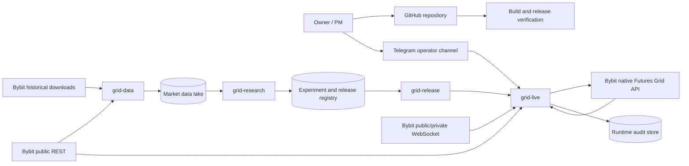

# System Context

## Actors

- **Owner/PM:** defines scope, risk limits, acceptance criteria, promotion, and live permissions.
- **Research operator:** launches data and research jobs, reviews evidence, does not possess live trade credentials by default.
- **Live operator:** supervises live state, approvals, pause, close, and emergency controls.
- **Implementation agent/contributor:** implements bounded tasks under PM-owned acceptance criteria.
- **Bybit:** source of public history, real-time market data, instrument constraints, account state, and native grid execution.
- **Telegram:** operator notification and controlled commands; never the sole source of truth.

## External systems

## Trust boundaries

1. **Public internet → data plane:** all downloaded files and responses are untrusted until schema, checksum, range, and semantic validation pass.
2. **Research → release:** research output is untrusted until independent verifier checks required members, hashes, status, compatibility, and gates.
3. **Release → live:** only explicitly promoted releases are trusted; live re-verifies on startup.
4. **Telegram → live:** commands require authorized identities, anti-replay handling, and stateful confirmation.
5. **Live → Bybit:** requests are signed, idempotency-aware, deadline-bound, and reconciled.
6. **Bybit → local state:** exchange state is authoritative, but responses are still validated for schema and identity consistency.

## Data ownership

| Data | System of record |
|---|---|
| Historical market datasets | Immutable market store + manifest catalog |
| Research runs | Experiment registry and hashed artifacts |
| Promoted strategy | Strategy release registry |
| Active bot/order/position state | Bybit; local state is a reconciled cache |
| Operator permissions | Runtime configuration/secret store |
| Audit evidence | Append-only runtime audit store and archived receipts |
| Project scope and gates | GitHub documentation owned by owner/PM |
