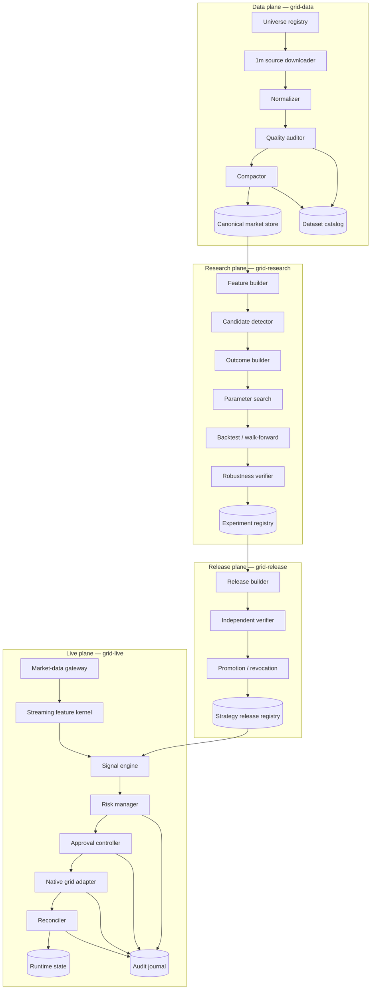

# Target Architecture

## Architectural style

A modular monorepo with four independently deployable applications and versioned shared contracts.

- **Data plane:** acquire and curate historical datasets.
- **Research plane:** build features, candidates, outcomes, parameter searches, and validation reports.
- **Release/control plane:** verify and promote immutable strategy bundles.
- **Live plane:** operate current signals and native grid bots safely.

## Top-level components



## Dependency rule

```text
contracts
├── data contracts
├── feature specification
├── strategy release schema
├── risk policy schema
└── audit event schema

feature-kernel ──> contracts
market-store   ──> contracts
research       ──> contracts + feature-kernel + market-store
release        ──> contracts + research-artifact readers
live           ──> contracts + feature-kernel + release reader + Bybit adapters
```

Forbidden dependencies:

- live → research orchestration;
- live → historical market store;
- live → experiment registry;
- data → live execution;
- research → live secrets;
- release verifier → release builder internals that could bypass independent checks.

## Application boundaries

### `grid-data`

Responsibilities:

- universe snapshots and stable instrument IDs;
- compatible one-minute bulk discovery/download when available;
- paginated REST backfill;
- normalization and schema validation;
- duplicate/conflict/gap detection;
- staged writes, compaction, and dataset commit;
- dataset catalog and receipts.

It has no authenticated trading client.

### `grid-research`

Responsibilities:

- read committed dataset versions only;
- reusable feature materialization;
- candidate detection and sparsification;
- outcome simulation;
- parameter search;
- walk-forward/out-of-symbol/stress analysis;
- experiment artifacts and reports.

It cannot create or promote a live release by itself.

### `grid-release`

Responsibilities:

- collect required research artifacts;
- validate complete status and compatibility;
- produce canonical hashes and manifest;
- run independent verifier;
- record promotion or revocation.

It never receives a trading API secret.

### `grid-live`

Responsibilities:

- load and verify one promoted release;
- maintain current 1m rolling windows;
- compute streaming features and signals;
- enforce risk, data freshness, approvals, and limits;
- call native futures-grid validate/create/detail/close endpoints;
- reconcile after timeouts, reconnects, and restarts;
- expose Telegram operations and observability;
- maintain append-only audit evidence.

It has no need for notebooks, parameter search, DuckDB research catalog, or historical Parquet corpus.

## Internal service patterns

- Typed ports/adapters for Bybit, storage, clock, secrets, Telegram, and metrics.
- Deterministic domain core separated from network and filesystem effects.
- Explicit state machines for datasets, experiments, releases, signals, approvals, bots, and emergency mode.
- Idempotency keys for commands and exchange actions.
- Atomic file publication and transactional runtime state.
- Schema-version compatibility matrix enforced at all boundaries.

## Deployment evolution

### Local development

Four commands/environments may share one workstation but use separate directories and configuration.

### Research workstation

High-core-count CPU, 64–128 GB RAM, NVMe scratch/store. No live trade credentials.

### Live host

Small, hardened VPS/host with only the live package, promoted release, runtime database, secrets, and logs. No multi-billion-row market store.

### Scale-out option

Parquet datasets may move behind an S3-compatible interface; batch jobs may be distributed by deterministic shards. The contracts and release boundary remain unchanged.
