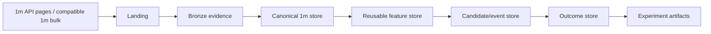

# Data Platform Architecture

## Objectives

The data platform must ingest, validate, version, and serve a theoretical 3.68-billion-row trade-price corpus without turning every research question into a full rescan or producing an unmanageable small-file layout.

## Source priority

1. **Bybit public V5 REST** for trade-price 1m, mark-price 1m, funding, and metadata.
2. **Verified one-minute bulk products** may replace matching REST ranges if Bybit advertises a
   compatible schema and the project verifies semantics, provenance, and conflict handling.
3. **Bybit public WebSocket** for live current candles; REST backfill closes reconnect gaps.

Tick-level public-trade archive bodies are not a V1 source and are neither downloaded nor retained.

Source provenance is retained per file/range. A value from one source cannot silently overwrite a conflicting value from another source.

Current instrument `launchTime` is a probe bound, not proof of source availability. Before a
canonical range is committed, the downloader records the actual earliest/latest response and an
explicit reason for every lifecycle/source mismatch. Empty ranges are evidence, never fabricated
candles.

Public REST concurrency is evidence-driven rather than inferred from the exchange ceiling. The
bounded M1 sweep retains at least 20% documented IP-limit headroom, disables hidden retries, and
persists no market values. Its 24-worker/10-RPS confirmation completed 100 full 1m pages without
endpoint errors, included an 8.078-second maximum response latency, and measured 7.764397 RPS.
This is a
finite-run baseline, not an accepted production rate; Phase 2 must add adaptive throttling,
durable resume, and long-run validation.

## Data layers



### Landing

Temporary, preflight-bounded workspace for REST pages or compatible one-minute bulk files. Files
are untrusted and may be deleted after a committed Bronze/canonical receipt exists. Tick-trade
archive bodies must not enter Landing.

### Bronze evidence

Preserves source identity, checksum where available, request range, download time, endpoint
identity, and parser version. Retaining every raw JSON page is optional; request receipts and
canonical provenance are mandatory. Tick-trade archives are not retained as Bronze evidence.

### Canonical market store

Normalized, query-optimized Parquet datasets with strict schemas and unique keys.

Primary datasets:

- `instrument_snapshot`;
- `trade_kline_1m`;
- `mark_kline_1m`;
- `funding_event`;
- `fee_schedule_snapshot`;
- `risk_limit_snapshot` when needed;
- `data_gap` and `data_conflict` evidence.

### Derived stores

- reusable rolling features;
- range candidates;
- future outcomes/grid simulations;
- experiment aggregates.

Derived data always references exact parent dataset IDs and feature/outcome contract versions.

## Stable instrument identity

Symbols are not sufficient primary identities because contracts can change status, metadata, or naming conventions. The universe registry assigns a stable integer `instrument_id` and records dated attributes:

- symbol;
- category;
- contract type;
- quote/settle coin;
- launch time;
- delivery/delisting/status intervals;
- tick size and quantity step;
- leverage and order limits;
- funding interval;
- eligibility flags.

Research joins by `instrument_id` and effective timestamp, not by today's symbol metadata.

## Canonical 1m key

```text
(dataset_id, instrument_id, open_time_ms)
```

A duplicate with identical values is redundant. A duplicate key with different values is a conflict and blocks dataset completion until resolved.

## Physical Parquet layout

Recommended starting layout:

```text
market-store/
  datasets/<dataset-id>/
    dataset=trade_kline_1m/
      schema=v1/
        year=YYYY/
          month=MM/
            bucket=BB/
              part-<sha256>.parquet
    audit.json
    manifest.json
    completion-receipt.json
```

Where:

- `bucket = stable_hash(instrument_id) mod 8`;
- Phase 2 freezes the stable hash algorithm in the versioned dataset contract before publication;
- rows are sorted by `instrument_id, open_time_ms`;
- files use the measured 16 MiB (`16,777,216` byte) target, with explicit tail-file semantics;
- row groups are sized and sorted to maximize statistics-based skipping;
- canonical candle files use ZSTD compression level 3.

### Why not partition by symbol

A symbol/year/month layout produces up to 84,000 logical symbol-month partitions for 700 instruments over ten years, often with small files. Excessive small files increase discovery, metadata, open/close, and planning overhead. Monthly time partitions plus a small bucket count keep files large while retaining symbol pruning through bucket lookup, sorting, row-group statistics, and Bloom filters where supported.

### Why not one file for everything

Very large monolithic files make incremental repair, compaction, concurrency, backup, and failure recovery unnecessarily expensive. Month + bucket provides bounded rewrite units.

## Canonical numeric representation

### Research store

- timestamps: signed 64-bit UTC milliseconds;
- `instrument_id`: compact integer;
- OHLC: signed Int64 units of `1e-8` with versioned Arrow/Parquet scale metadata;
- volume: Decimal128(38, 4);
- turnover: Decimal128(38, 12);
- quality/status flags: compact integers/booleans;
- symbol string is omitted from every candle row and joined through the registry when needed.

The `hybrid_int64_decimal` representation, eight-bucket/16-MiB layout, and ZSTD level 3 were
accepted in ADR-0020 after the qualified Gate 1 campaign. Values outside the physical precision
contract require a new schema version and may not be silently rounded.

### Execution boundary

Float values from the research store are never copied directly into order/grid payloads. Live converts strategy intent using current metadata and exact decimal/integer tick-step arithmetic, then verifies the final rounded values.

## Build and commit protocol

1. Create unique `.building/<run-id>` workspace.
2. Resolve source and target ranges.
3. Validate configuration, free space, schema versions, and ownership before mutation.
4. Download/parse to staged partitions.
5. Sort, deduplicate, and compare with existing committed ranges.
6. Run structural and semantic quality checks.
7. Write Parquet files and file hashes.
8. Write manifest and audit summary.
9. Atomically publish files or move a version pointer.
10. Write the completion receipt last; it is the commit marker.

A directory without a valid completion receipt is not a committed dataset.
ADR-0022 additionally requires a no-mutation host/capacity preflight, a fresh recheck immediately
before the first write, same-volume building/final paths, closed Parquet handles before the atomic
directory rename, canonical manifest/receipt bytes, and orphan detection.

## Quality checks

Required checks include:

- unique canonical keys;
- monotonic minute intervals within instrument segments;
- OHLC invariants;
- finite numeric values and expected sign/range constraints;
- no candle before launch or after effective close/delisting interval;
- source request/page coverage;
- unresolved gaps and reason codes;
- conflicting duplicate evidence;
- file hash and Parquet footer validation;
- orphan and unreferenced file detection;
- stale `.building` detection;
- schema and dataset-parent compatibility.

## Gap policy

Not every absent minute is automatically an error. Each gap receives a reason:

- instrument not yet listed;
- instrument suspended/closed;
- source archive unavailable;
- REST returned no data;
- network/request failure;
- unresolved conflict;
- confirmed no-trade interval, if contract semantics allow it;
- unknown.

Only explicitly accepted reasons may be present in a complete dataset. `unknown` blocks completion.

## Incremental operation

- New daily/hourly ranges append as new immutable files.
- Late corrections create a new dataset version or partition replacement with lineage; committed files are not edited in place.
- Periodic compaction merges small incremental files into target-size files.
- Catalog statistics allow research jobs to select only required partitions.
- Resume uses receipts, not directory guessing.

## Catalog

A lightweight metadata catalog—initially SQLite or DuckDB—stores:

- dataset IDs and status;
- parent IDs;
- schema versions;
- files, hashes, row counts, byte sizes;
- min/max time and instrument ranges;
- gap/conflict summaries;
- build configuration hash;
- code/version identity;
- completion receipt location.

The catalog contains metadata, not the full candle corpus.
