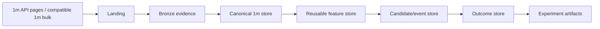

# Data Platform Architecture

## Objectives

The data platform must ingest, validate, version, and serve a theoretical 3.68-billion-row trade-price corpus without turning every research question into a full rescan or producing an unmanageable small-file layout.

## Source priority

1. **Bybit public V5 REST** for trade-price 1m, mark-price 1m, funding, and metadata.
2. **Verified one-minute bulk products** may replace matching REST ranges if Bybit advertises a
   compatible schema and the project verifies semantics, provenance, and conflict handling.
3. **Bybit public WebSocket** for live current candles; REST backfill closes reconnect gaps.

Tick-level public-trade archive bodies are not a V1 source and are neither downloaded nor retained.

Source provenance is retained per file/range. A value from one source cannot silently overwrite a conflicting value from another source.

Current instrument inventory uses the dated ADR-0042 status policy: separate `PreLaunch`,
`Trading`, `Delivering`, and `Closed` queries, matching the normative Bybit V5 enum verified on
2026-08-13. Every policy query and returned status partition must agree before an observation is
labelled complete-current. This does not backfill historical point-in-time metadata.

Current instrument `launchTime` is a probe bound, not proof of source availability. Before a
canonical range is committed, the downloader records the actual earliest/latest response and an
explicit reason for every lifecycle/source mismatch. Empty ranges are evidence, never fabricated
candles.

Public REST concurrency is evidence-driven rather than inferred from the exchange ceiling. The
bounded M1 sweep retains at least 20% documented IP-limit headroom, disables hidden retries, and
persists no market values. Its 24-worker/10-RPS confirmation completed 100 full 1m pages without
endpoint errors, included an 8.078-second maximum response latency, and measured 7.764397 RPS.
This is a
finite-run baseline, not an accepted production rate; Phase 2 must add adaptive throttling,
durable resume, and long-run validation.

ADR-0023 implements the first durable Phase 2 baseline with a global 10-RPS pacer, fixed
non-overlapping pages, explicit bounded retries, page receipts, and receipt-based resume. It does
not raise its operating rate automatically. ADR-0043 extends the same global pacer with
decrease-only response-header adaptation: low headroom caps the effective rate, 429/retCode 10006
halve it and impose a cooldown. ADR-0060 distinguishes the documented `403, access too frequent`
ten-minute IP-ban response from a CloudFront regional-access block: both abort globally, while the
regional case is not retried and does not invent a cooldown or alternate-host path.
Missing/invalid headers are counted and never interpreted as permission to increase. Receipt-bound
long-run qualification remains required before full-universe scale or any operating-rate increase.
ADR-0044 makes that qualification reproducible: new child manifests bind
execution start/completion, and the strict campaign evidence projection checks sanitized adaptive
response accounting without publishing response or market data. ADR-0045 defines the measured
boundary: every completed page response must have an observation,
while retryable transport attempts that produced no HTTP response are counted separately rather
than being mislabeled as missing headers.

ADR-0032 adds the separate funding path. Each series has one receipted predecessor query and
fixed range pages of at most seven days/200 rows. A range response with the full requested limit
is rejected as potentially truncated. The predecessor and requested events derive historical
intervals from settlement chronology; the current registry interval is not reused as historical
truth. Funding Landing has its own manifest and completion receipt, while host/capacity admission,
bounded concurrency, explicit retries, and receipt-based resume remain consistent with 1m jobs.
ADR-0048 adds a separate prerequisite for ranges whose registry-bounded predecessor is absent.
It scans the public funding endpoint backward with an explicit oldest-minus-one cursor, receipts
timestamp-only pages, validates but does not retain exact rates, and identifies the second-oldest
source-observed settlement as the earliest canonical start with a proven predecessor. Registry
launch time remains a query bound rather than source-availability proof. The discovery does not
accept source absence or historical cadence and does not publish canonical data.
ADR-0049 adds the GitHub-safe projection of one fully re-verified discovery. It exposes only
aggregate scope/counts, transitive hashes, immutable code identities, fixed redaction/limitations,
and strict adaptive response accounting. Symbols, instrument IDs, observed settlement timestamps,
rates, runtime paths, host/account data, and credentials remain outside Git.
ADR-0034 adds a read-only funding chronology audit: exact source/canonical parity, range-page
tiling, predecessor/internal interval recomputation, and stable observed cadence. Empty pages and
cadence changes remain blocked without dated evidence; current interval metadata is never used as
historical truth.

ADR-0038 adds the multi-job orchestration boundary without weakening those child contracts. One
campaign request is deterministically split by dataset type, UTC month, and the accepted eight
buckets. All children are preflighted before mutation; aggregate admission reserves the complete
remaining Landing bound once alongside active-plus-building and the operating reserve. Children
run sequentially so their pacers cannot multiply the target RPS. The campaign plan is committed
before the first child, each existing child receipt is reused, and an aggregate manifest receipt
is written only after all child allowlists and hashes verify. Registry lifecycle intersection is
ex-post acquisition scoping, not point-in-time research metadata.

ADR-0047 removes redundant input admission inside that boundary. Each campaign invocation
receipt-verifies and hashes the registry/capacity artifacts once, then derives every child from
that single path-checked in-process snapshot. A later execute or resume invocation reloads the
artifacts; no verified object is cached across commands. Child plan hashes, resource bounds,
sequential pacing, and all fail-closed checks remain unchanged.

ADR-0039 adds the separate Landing-to-canonical campaign boundary. It re-verifies one completed
campaign, resolves each candle/funding publication one at a time, and freezes all source,
input-table, canonical-request, dataset, and publisher identities before mutation. Canonical
writers run strictly sequentially and resume from their own immutable completion receipts. The
aggregate resource gate uses the maximum single-child writer requirement because every child
already reserves the same full active-plus-building envelope and only one write workspace exists
at a time. A campaign manifest receipt is committed only after every canonical dataset verifies;
coverage audits and catalog registration remain separate.

ADR-0046 distinguishes initial semantic admission from later receipt-integrity reverification.
Acquisition completion, every pending canonical child, and every coverage audit still decode and
validate exact source rows. Once an aggregate canonical publication is committed, reuse,
independent publication verification, and its GitHub-safe evidence instead hash every Landing
page and verify every page/child/aggregate receipt and manifest fact without rebuilding source
Arrow batches; canonical Parquet remains fully verified. Batch loading cannot select this mode.
The same accepted boundary applies when a history campaign resumes an immutable completed Landing
child: preflight hashes and receipt-verifies it once, the executor reuses that verified in-process
result, and no object survives the command. Partial children, initial completion, canonical
admission, coverage audits, and explicit semantic campaign verification continue to decode every
source row. The final aggregate campaign receipt is still independently verified before return.
ADR-0059 projects the post-merge local measurement into strict receipt-last GitHub evidence bound
to the exact campaign/input/implementation hashes. Its first pending failure is a local synthetic
403, so the qualification measures integrity traversal and fail-closed handoff without network
access or disclosure of runtime identities.

## Data layers



### Landing

Temporary, preflight-bounded workspace for REST pages or compatible one-minute bulk files. Files
are untrusted and may be deleted after a committed Bronze/canonical receipt exists. Tick-trade
archive bodies must not enter Landing.

The first REST implementation stores one canonical JSON artifact and receipt per fixed page under
`.landing/<job-id>--<plan-hash>/pages/`. A verified completion receipt makes the Landing batch
loadable; it does not make the batch a committed canonical dataset.

### Bronze evidence

Preserves source identity, checksum where available, request range, download time, endpoint
identity, and parser version. Retaining every raw JSON page is optional; request receipts and
canonical provenance are mandatory. Tick-trade archives are not retained as Bronze evidence.

### Canonical market store

Normalized, query-optimized Parquet datasets with strict schemas and unique keys.

Primary datasets:

- `instrument_snapshot`;
- `trade_kline_1m`;
- `mark_kline_1m`;
- `funding_event`;
- `fee_schedule_snapshot`;
- `risk_limit_snapshot` when needed;
- `data_gap` and `data_conflict` evidence.

### Derived stores

- reusable rolling features;
- range candidates;
- future outcomes/grid simulations;
- experiment aggregates.

Derived data always references exact parent dataset IDs and feature/outcome contract versions.

## Stable instrument identity

Symbols are not sufficient primary identities because contracts can change status, metadata, or naming conventions. The universe registry assigns a stable integer `instrument_id` and records dated attributes:

- symbol;
- category;
- contract type;
- quote/settle coin;
- launch time;
- delivery/delisting/status intervals;
- tick size and quantity step;
- leverage and order limits;
- funding interval;
- eligibility flags.

Research joins by `instrument_id` and effective timestamp, not by today's symbol metadata.

For the Phase 2 Bybit-linear v1 namespace, ADR-0023 freezes
`instrument_id = source_symbol_id` after verifying positive UInt32 range and snapshot-wide
uniqueness. Requests contain symbols, never caller-supplied IDs. Other categories or exchanges
require a new namespace policy rather than reusing these integers silently.

ADR-0037 adds an immutable registry timeline. Research selects only the latest snapshot observed
at or before its decision timestamp; it fails before the first snapshot and can require complete
inventory evidence. A separate ex-post view may use consistent launch/delivery bounds to explain
canonical data coverage, but cannot expose a later delisting or today's trading constraints to an
earlier decision. Partial status inventories, conflicting bounds, symbol reuse, suspensions, and
source omissions remain explicit blockers.

## Canonical 1m key

```text
(dataset_id, instrument_id, open_time_ms)
```

A duplicate with identical values is redundant. A duplicate key with different values is a conflict and blocks dataset completion until resolved.

## Physical Parquet layout

Recommended starting layout:

```text
market-store/
  datasets/<dataset-id>/
    dataset=trade_kline_1m/
      schema=v1/
        year=YYYY/
          month=MM/
            bucket=BB/
              part-<sha256>.parquet
    audit.json
    manifest.json
    completion-receipt.json
```

Where:

- `bucket = stable_hash(instrument_id) mod 8`;
- Phase 2 freezes the stable hash algorithm in the versioned dataset contract before publication;
- rows are sorted by `instrument_id, open_time_ms`;
- files use the measured 16 MiB (`16,777,216` byte) target, with explicit tail-file semantics;
- row groups are sized and sorted to maximize statistics-based skipping;
- canonical candle files use ZSTD compression level 3.

Canonical funding uses the same UTC month/eight-bucket/16-MiB/ZSTD-3 envelope under
`dataset=funding_event`, but has its own `grid.canonical-funding-layout/v1` schema. Rows are sorted
by `instrument_id, funding_time_ms`; rates are exact signed Decimal128(38, 18). The interval is
the elapsed time since the preceding authoritative settlement and cannot be backfilled from
today's undated instrument metadata. Receipt-last publication and verification are defined in
ADR-0031.

### Why not partition by symbol

A symbol/year/month layout produces up to 84,000 logical symbol-month partitions for 700 instruments over ten years, often with small files. Excessive small files increase discovery, metadata, open/close, and planning overhead. Monthly time partitions plus a small bucket count keep files large while retaining symbol pruning through bucket lookup, sorting, row-group statistics, and Bloom filters where supported.

### Why not one file for everything

Very large monolithic files make incremental repair, compaction, concurrency, backup, and failure recovery unnecessarily expensive. Month + bucket provides bounded rewrite units.

## Canonical numeric representation

### Research store

- timestamps: signed 64-bit UTC milliseconds;
- `instrument_id`: compact integer;
- OHLC: signed Int64 units of `1e-8` with versioned Arrow/Parquet scale metadata;
- volume: Decimal128(38, 4);
- turnover: Decimal128(38, 12);
- quality/status flags: compact integers/booleans;
- symbol string is omitted from every candle row and joined through the registry when needed.

The `hybrid_int64_decimal` representation, eight-bucket/16-MiB layout, and ZSTD level 3 were
accepted in ADR-0020 after the qualified Gate 1 campaign. Values outside the physical precision
contract require a new schema version and may not be silently rounded.

### Execution boundary

Float values from the research store are never copied directly into order/grid payloads. Live converts strategy intent using current metadata and exact decimal/integer tick-step arithmetic, then verifies the final rounded values.

## Build and commit protocol

1. Create unique `.building/<run-id>` workspace.
2. Resolve source and target ranges.
3. Validate configuration, free space, schema versions, and ownership before mutation.
4. Download/parse to staged partitions.
5. Sort, deduplicate, and compare with existing committed ranges.
6. Run structural and semantic quality checks.
7. Write Parquet files and file hashes.
8. Write manifest and audit summary.
9. Atomically publish files or move a version pointer.
10. Write the completion receipt last; it is the commit marker.

A directory without a valid completion receipt is not a committed dataset.
ADR-0022 additionally requires a no-mutation host/capacity preflight, a fresh recheck immediately
before the first write, same-volume building/final paths, closed Parquet handles before the atomic
directory rename, canonical manifest/receipt bytes, and orphan detection.

ADR-0024 binds a verified Landing completion to this writer. The adapter re-verifies and hash-binds
the Landing manifest, instrument registry, accepted capacity evidence, exact Arrow input, physical
layout, and explicit software identity. Its deterministic dataset ID is derived from the complete
Landing manifest hash. Publication is no-mutation by default and repeats a fresh host observation
before `--execute`; successful writing is not lifecycle/gap acceptance.

ADR-0039 composes that adapter with the funding equivalent for a completed ADR-0038 campaign. Its
runtime aggregate plan lives under `.publication-campaigns`, never embeds Arrow batches, and uses
each canonical completion receipt as the resume marker. It neither merges partitions nor changes
the immutable single-child layout. Aggregate preflight uses a typed verified-child handoff: each
Landing page is digest-checked and decoded once for its child, the resulting batch is used only
for that child's publication preflight, and no batch survives into the aggregate plan. Execution
still performs a fresh complete child verification immediately before that child can mutate the
canonical store, and final aggregate verification remains independent.

GitHub is the source of truth for implementation and sanitized evidence under ADR-0025. Runtime
Landing and canonical market values remain outside Git, while a small receipt-last pilot artifact
records their canonical hashes, requested ranges, exact 1m coverage, counts, immutable publisher
commit, and limitations. A hash-bound summary makes substitution detectable without turning the
public repository into the market-data store.

ADR-0040 applies the same boundary to an entire ADR-0039 publication campaign. Its evidence
builder first re-verifies the source campaign and every canonical file/audit/manifest/receipt,
then emits only aggregate and per-kind counts/bytes, maximum sequential-child resource bounds,
immutable Git identities, and transitive hashes. Dataset, symbol, and instrument identities,
runtime paths, market values, account data, and credentials are excluded by the exact schema.

ADR-0041 composes the candle and funding coverage auditors over a completed publication without
changing their reason policies. It audits one child at a time, publishes each child content hash
and aggregate quality/reason counters, and propagates any blocked child to the aggregate result.
Detailed child identities and diagnostics remain outside the GitHub-safe aggregate.

## Quality checks

Required checks include:

- unique canonical keys;
- monotonic minute intervals within instrument segments;
- OHLC invariants;
- finite numeric values and expected sign/range constraints;
- no candle before launch or after effective close/delisting interval;
- source request/page coverage;
- unresolved gaps and reason codes;
- funding predecessor/internal interval parity, empty windows, and unexplained cadence changes;
- conflicting duplicate evidence;
- file hash and Parquet footer validation;
- orphan and unreferenced file detection;
- stale `.building` detection;
- schema and dataset-parent compatibility.

## Gap policy

Not every absent minute is automatically an error. Each gap receives a reason:

- instrument not yet listed;
- instrument suspended/closed;
- source archive unavailable;
- REST returned no data;
- network/request failure;
- unresolved conflict;
- confirmed no-trade interval, if contract semantics allow it;
- unknown.

Only explicitly accepted reasons may be present in a complete dataset. `unknown` blocks completion.

ADR-0026 implements the first read-only requested-range audit. It proves exact Landing/canonical
table parity and accounts for missing, duplicate, unexpected, unrequested, and lifecycle-invalid
rows. V1 accepts no absence reason; a verified REST response with no candle is recorded as
`rest_returned_no_data` and blocks. Exact historical lifecycle-bound discovery remains a separate
requirement, so a passing bounded audit is not full-universe completeness.

ADR-0053 makes that reason exact when ADR-0050 quarantine is present. A receipt-bound source row
excluded for an OHLC envelope violation is `quarantined_source_row`, not
`rest_returned_no_data`; it remains a blocker even if its key is otherwise covered. Exact keys
stay in runtime verification, while aggregate campaign evidence may expose only the reason count.

ADR-0027 implements deterministic repair planning without downloading or mutating data. It
recomputes a receipt-verified blocked audit, permits only `rest_returned_no_data` missing-minute
blockers, and emits one standard bounded history request per complete contiguous gap. The plan
binds the original Landing and canonical manifests, every embedded request hash, and the planner's
Git commit. A quarantined source row is explicitly ineligible for this same-endpoint repair path
and requires separate reviewed source reconciliation.

ADR-0028 executes that plan only after every standard request and their aggregate staging budget
pass a no-mutation preflight. Each task retains the existing page receipts and resume behavior;
the plan passes only when every missing minute is returned exactly once. Publication then creates
a deterministic new dataset identity, records the old dataset as its sole parent, proves the
complete requested key union, and writes a receipt-last value-free replacement proof. A repeated
empty response remains blocked, and the old canonical files are never edited or deleted.

ADR-0054 provides the corresponding immutable maintenance boundary for sparse funding fragments.
It accepts only receipt-verified parents from one month/bucket, verifies exact Decimal128 funding
schema and sorted unique keys, checks settlement intervals across former parent boundaries, and
reduces at least two files to one receipt-last child. Compaction preserves existing chronology
status; it never converts a blocked funding reason into acceptance.

ADR-0061 adds bounded candidate discovery without weakening that boundary. Every receipt-verified
same-partition funding pair is checked with the same schema/key/interval semantics and classified
before any compaction is proposed. Detailed dataset and partition bindings remain private; GitHub
receives only store/audit hashes and aggregate eligible/duplicate/interval/schema counts. A
no-candidate result is store-state evidence, not a substitute for measured compaction when a real
incremental or repair fragment later appears.

ADR-0062 adds post-merge fault-injection evidence for stale write-state detection. An offline
temporary store injects deterministic markers at candle publication, funding publication, candle
compaction, catalog building, and catalog lock boundaries; the production preflights must reject
each marker without deleting it or creating the target. Only sanitized case/count outcomes enter
Git. This supports one unchanged Gate 2 criterion and does not automatically accept the gate.

ADR-0063 adds a receipt-bound Gate 2 readiness projection over eight fixed public evidence
artifacts. It rechecks their schemas, artifact/content hashes, receipts, scope, and cross-source
lineage, then preserves two `evidence-ready` and four blocked criteria with explicit blocker codes.
It performs no network or market-store mutation and cannot accept Gate 2 or authorize Phase 3.

ADR-0064 adds post-merge orphan/partial-write detection evidence. Temporary cloned candle and
funding commits receive an orphan file, missing Parquet, or missing completion receipt; the real
production verifiers must reject all six cases while preserving the complete injected filesystem
fingerprint. The retained store is not accessed or repaired.

ADR-0055 adds the first funding-specific repair boundary as discovery-only planning. It
recomputes a blocked ADR-0034 audit and admits only a complete set of isolated integer-multiple
`C, N*C, C` interval sandwiches when no other blocker exists. Candidate timestamps are derived
from adjacent source-observed settlements and embedded in bounded standard funding requests;
current interval metadata is never used, no request is executed, and the audit remains blocked.
Real plans contain exact settlement identities and stay in private runtime storage.

ADR-0056 executes only a fully reverified ADR-0055 plan. All embedded requests and their combined
remaining staging requirement pass one no-mutation preflight before the first public request.
Tasks then reuse the standard receipt-resumable funding Landing primitive sequentially. A task is
`passed` only when source-returned timestamps equal every candidate exactly once; empty, partial,
or unexpected results remain blocked. The rate-free execution record is still private because it
contains instrument and settlement identities. Parent publication and the original blocked audit
remain unchanged.

ADR-0057 permits a separate immutable repair child only after that execution passes. The adapter
re-verifies the entire private chain, rejects overlap and partition/schema mismatch, combines the
parent with exact source-confirmed rows, and recomputes funding intervals from adjacent observed
settlements. It preserves the parent's first-event boundary evidence and writes through the same
fresh-host, atomic-directory, completion-receipt-last funding primitive. The parent and blocked
audit remain immutable. Separate receipt-last public projections expose only hashes and aggregate
counts, never instrument identities, settlement timestamps, funding rates, or runtime paths.

ADR-0058 adds the mandatory read-only audit over that committed child. It verifies the complete
plan/execution/parent/replacement chain, reconstructs the exact original-plus-repair source union,
and applies the ADR-0034 parity, predecessor, adjacent-interval, page-tiling, lifecycle, duplicate,
empty-window, and cadence-change checks. Verification does not inherit current free-space or
memory write gates. The detailed receipt-last result stays private because its series records
contain exact identifiers and observed time bounds. A pass does not change the original blocked
audit, accept a general cadence policy, register the child, or close Gate 2.

## Incremental operation

- New daily/hourly ranges append as new immutable files.
- Late corrections create a new dataset version or partition replacement with lineage; committed files are not edited in place.
- Gap repair is planned from a recomputed blocked audit; planning never edits the committed dataset or performs a market request.
- Repair execution uses standard receipted Landing jobs after whole-plan resource admission; a
  passed execution is still not a canonical mutation.
- A successful repair publishes a new child dataset with the old manifest and every repair source
  hash in lineage; it never patches the parent in place.
- Funding repair planning is discovery-only: exact candidate settlements must later be returned
  by the public source before an immutable funding child can be proposed.
- Funding discovery execution runs only after whole-plan capacity admission, persists ordinary
  page/manifest receipts, and cannot publish or mutate the canonical parent.
- A funding repair child is eligible for catalog transition only after a separate receipt-verified
  post-publication audit passes over the exact original-plus-repair source union.
- Periodic compaction verifies one or more immutable parents from exactly one month/bucket,
  rejects every duplicate/conflicting key, and writes a new receipt-last child. It calibrates the
  16 MiB ZSTD-3 row target from a bounded in-memory sample, permits only one explicit final tail,
  records observed target classification per file, and runs only when output file count is lower
  than input fragment count. Parents are never edited or deleted (ADR-0029).
- Catalog statistics allow research jobs to select only required partitions.
- Resume uses receipts, not directory guessing.

## Catalog

A lightweight metadata catalog—initially SQLite or DuckDB—stores:

- dataset IDs and status;
- parent IDs;
- schema versions;
- files, hashes, row counts, byte sizes;
- min/max time and instrument ranges;
- gap/conflict summaries;
- build configuration hash;
- code/version identity;
- completion receipt location.

The catalog contains metadata, not the market-value corpus.

ADR-0030 implements the first catalog boundary with DuckDB. Registration accepts only complete,
receipt-verified canonical trade/mark 1m datasets, requires complete registered parent lineage,
and stores a logical receipt/object identity rather than an absolute host path. Conflict count is
zero only because canonical verification proves sorted unique keys; gap status remains explicitly
`not-assessed-by-dataset-receipt` until separate coverage evidence is admitted.

The DuckDB file is a rebuildable runtime index, not a dataset commit marker. Each atomic
registration increments a revision and hashes the canonical logical catalog rows independently of
DuckDB file bytes. Range-selection requests bind that exact revision/hash and explicit dataset IDs;
there is no implicit `latest`. Selection re-verifies manifests/files, requires the requested
month/bucket set, rejects ancestor-plus-child and overlapping key ranges, and returns only
store-relative object keys. Selection proves pruning, not gap-free coverage.

ADR-0035 extends the same backward-compatible catalog boundary to receipt-verified canonical
`funding_event` datasets. Funding registration reads first/last keys from
`instrument_id, funding_time_ms`; trade/mark registration continues to use `open_time_ms`.
Selection remains bound to exactly one dataset type, so funding and candle dataset IDs cannot be
mixed in one request. Funding registration/selection does not admit chronology evidence or imply
complete lifecycle coverage.
