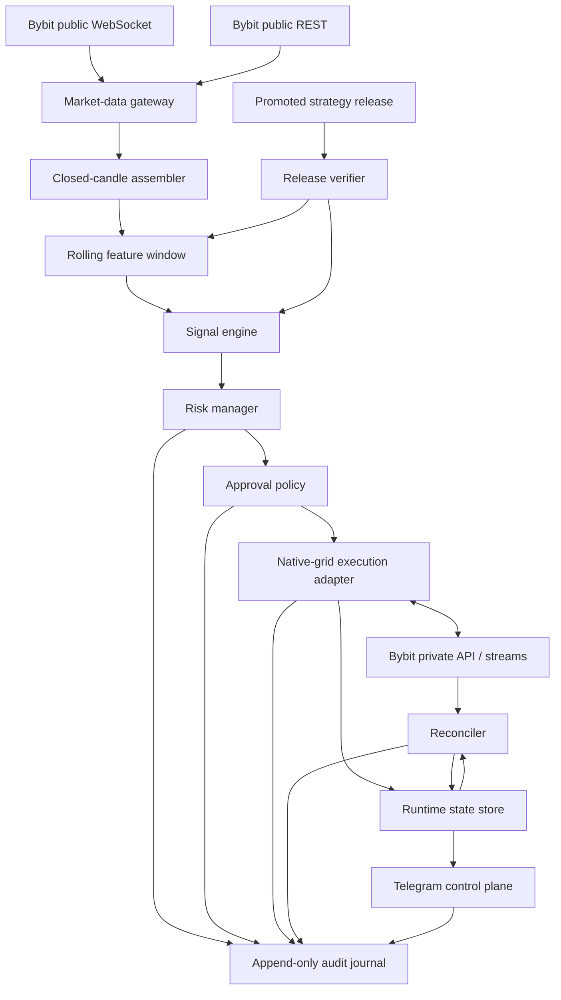

# Live Architecture

## Purpose

`grid-live` is a small, independently deployable runtime that detects current signals and controls native Bybit Futures Grid Bots from a **promoted strategy release**. It must be possible to install, start, stop, update, and recover live trading without installing the bulk-history downloader, DuckDB research catalog, optimizer, notebooks, or the multi-billion-row historical corpus.

Live is intentionally a different operational product from research. It optimizes for correctness, bounded latency, reconciliation, and fail-closed safety—not for maximum batch throughput.

ADR-0103 freezes the design-only Phase 7 shadow boundary while Gate 6 remains closed. Shadow uses a
mutation-free capability graph, deterministic cross-source watermark, bounded shared-kernel replay,
and transactional exactly-once decisions. See the
[M7 implementation plan](../planning/M7_SHADOW_LIVE_IMPLEMENTATION_PLAN.md). No Phase 7 network,
credential, deployment, or exchange action is authorized by that design.

## Non-negotiable boundary

`grid-live` may read only:

- a promoted, hash-verified strategy release;
- its own deployment configuration and secrets;
- a bounded rolling market-data window;
- its own runtime state and audit journal;
- current Bybit public/private API state.

It must not:

- import `grid-research` orchestration;
- open the historical Parquet lake or research DuckDB catalog;
- select or tune parameters;
- mutate a strategy release;
- silently weaken limits carried by the release;
- assume that an HTTP timeout means an order or bot was not created.

Phase 7 shadow additionally has no create/amend/cancel/close/transfer/withdrawal/leverage-mutation or
generic private-request method. Public/read-only reconciliation and explicitly allowlisted
validate-only capabilities are separate ports; a `dry_run` flag on a mutating adapter is not an
accepted safety boundary.

## Component model



The execution/approval path in this full target diagram belongs to later authorized modes. The
Phase 7 shadow composition stops at durable shadow intent and cannot register the mutating adapter.

## Market-data gateway

Responsibilities:

- subscribe to the required public 1m streams;
- accept only fully closed candles for decisions;
- detect disconnects, sequence gaps, duplicate candles, and stale data;
- repair bounded gaps through public REST;
- normalize current market data to the same semantic contract used by research;
- maintain only the warmup window required by the promoted release plus a small recovery margin;
- expose data freshness and completeness status to the risk manager.

The WebSocket is the normal low-latency path. REST is a deterministic recovery path, not a second independent signal source.

## Closed-candle rule

A signal for minute `t` may be produced only after the candle for `t` is confirmed closed and all required inputs for that minute are complete. A partial candle, missing mark-price input, stale instrument metadata, or unresolved gap causes `NO_TRADE`.

Live and research must use the same:

- timestamp convention;
- candle-close semantics;
- boundary inclusivity;
- rolling-window warmup;
- missing-data policy;
- numeric units and precision;
- feature version.

## Rolling feature window

The live feature kernel computes only the features declared by the release. It must be deterministic and parity-tested against the research feature implementation using golden fixtures.

State is bounded by:

```text
max_required_lookback
+ gap-repair margin
+ feature warmup
+ reconciliation replay margin
```

The feature window is checkpointed frequently enough to allow a quick restart, but a checkpoint is never trusted without comparing it to current exchange time and REST-repaired candles.

## Signal engine

The signal engine:

- evaluates the exact promoted candidate rules;
- chooses the exact parameter-table row through deterministic lookup;
- assigns a stable signal ID derived from release, symbol, signal time, and rule identity;
- prevents duplicate signal emission across restart;
- records all hard-filter outcomes, including why a candidate was rejected;
- never performs parameter search.

ADR-0103 binds signal identity to the exact release epoch, category, stable instrument ID,
closed-candle `decision_time_ns`, and rule ID. Transactional uniqueness plus an audit outbox prevents
duplicate decisions/intents across repeated messages, crashes, and restarts.

## Risk manager

The risk manager is the final no-trade authority. It applies the stricter of:

1. immutable release limits;
2. deployment-level operator limits;
3. current account and exchange constraints;
4. emergency/pause state.

A deployment configuration may tighten a release limit but must not loosen it.

Hard entry blocks include:

- unverified, revoked, expired, or incompatible release;
- stale or incomplete market data;
- uncertain account/bot reconciliation;
- existing active or uncertain grid for the symbol;
- emergency stop or paused entries;
- Bybit validate failure;
- projected maximum loss above the configured cap;
- insufficient balance or risk capacity;
- unsupported tick/quantity precision;
- clock drift outside policy;
- rate-limit pressure above the safe threshold;
- unavailable audit persistence.

## Approval policy

Initial real execution is manual. A signal transitions to `awaiting_approval` and receives a short-lived, single-use approval token. Approval must bind to:

- signal ID;
- release ID and hash;
- exact symbol and parameter payload hash;
- maximum loss;
- expiry;
- approver identity.

Changing any payload field invalidates the approval. Expired approvals cannot be reused.

## Native-grid execution adapter

The adapter is responsible for:

- instrument constraint refresh;
- exact decimal/tick/step conversions;
- validate-before-create;
- canonical request identity and idempotency guard;
- create, detail, monitor, and close operations;
- private execution/order/position stream consumption where applicable;
- safe handling of timeouts and ambiguous responses;
- redacted request/response evidence.

No binary float may be used at the exchange payload boundary. Values are represented as decimal or scaled integers, quantized according to the instrument contract, then serialized canonically.

## Uncertain-result protocol

A timeout, disconnect, or HTTP error after a mutating request creates an **uncertain state**, not permission to retry blindly.

Protocol:

1. persist the request identity and `*_uncertain` state;
2. block new actions for the same symbol;
3. query current grid/detail/account state through independent reads;
4. consume private-stream evidence when available;
5. reconcile to exactly one durable state;
6. require manual intervention if evidence remains contradictory.

This protects against duplicate bot creation and accidental double exposure.

## Runtime state machines

### Signal and bot lifecycle

```text
detected
  → filtered_out
  → validated
      → awaiting_approval
          → approval_expired
          → rejected_by_owner
          → approved
              → create_requested
                  → create_rejected
                  → create_uncertain
                  → active
                      → close_requested
                          → close_uncertain
                          → closed
                      → exchange_closed
                      → incident_hold
```

Every transition is validated, timestamped, and appended to the audit journal. Illegal transitions are rejected.

### Control-plane lifecycle

```text
starting
  → preflight_failed
  → reconciling
      → ready_paused
          → running
              → entries_paused
              → emergency_stopped
          → emergency_stopped

emergency_stopped → reconciling → ready_paused → explicit_manual_resume → running
```

Restart never implicitly clears an emergency stop.

## Startup preflight

Live does not enter `running` until all checks pass:

1. parse and validate configuration;
2. verify strategy release member allowlist, hashes, status, promotion, expiry, and compatibility;
3. open and integrity-check state/audit stores;
4. verify system clock and timezone policy;
5. authenticate read-only private calls before permitting mutations;
6. fetch account, bot, position, and open-order state;
7. reconcile exchange state with local state;
8. establish public/private streams;
9. repair and warm current market windows;
10. prove Telegram/operator authorization where required;
11. remain `ready_paused` until explicit start/resume policy is satisfied.

## Reconciliation

The exchange is authoritative for actual open exposure; the local state store is authoritative for expected workflow and audit history. Reconciliation compares both and classifies:

- exact match;
- exchange-only object;
- local-only expected object;
- status mismatch;
- amount/price mismatch;
- unknown external/manual activity;
- stale local transition;
- duplicate/ambiguous identity.

Any exposure-related mismatch pauses new entries. Resolution is recorded, never silently overwritten.

## Telegram control plane

Planned commands:

- `/status` — release, service, data freshness, risk, active/uncertain bots;
- `/pause_new_entries` — stop creation while continuing monitoring;
- `/resume` — permitted only after reconciliation and authorization;
- `/approve <signal-id> <token>` — bind approval to exact payload;
- `/reject <signal-id>`;
- `/close_bot <bot-id>`;
- `/close_all`;
- `/emergency_stop` — close according to emergency policy and block entries;
- `/incident <id>` — concise incident evidence.

Telegram is an operator interface, not the source of truth. Commands are authorized, rate-limited, replay-protected, and fully audited.

Phase 7 exposes only status, pause, reconciled resume, and persistent shadow-emergency operations.
Approve/create/close/close-all/transfer commands are structurally unavailable until a later gate and
are rejected/audited if requested.

## Live data footprint

A live node stores only:

- current release bundle and rollback bundle;
- current instrument metadata snapshot;
- bounded rolling candles/features;
- runtime relational state;
- append-only audit records;
- recent redacted API evidence;
- metrics and logs with retention limits.

The full historical lake and feature/outcome stores remain outside the live trust boundary.

## Live service objectives

Provisional objectives, subject to benchmark and operational review:

- closed-candle to decision p99: at most 5 seconds;
- normal startup/reconciliation: at most 60 seconds;
- no duplicate live action after restart or timeout;
- zero autonomous entry while reconciliation is uncertain;
- bounded steady-state memory target: at most 2 GB;
- recovery point: no loss of committed state transition or approval;
- emergency stop persists across restart.

## Live acceptance gate

Live execution remains disabled until the project proves:

- feature parity with research;
- release verification and revocation behavior;
- restart/idempotency tests;
- ambiguous-request reconciliation;
- stale/gapped data fail-closed tests;
- risk arithmetic and exact rounding tests;
- Telegram authorization and replay protection;
- shadow-mode stability;
- manual emergency drills;
- owner approval for the specific deployment mode.
